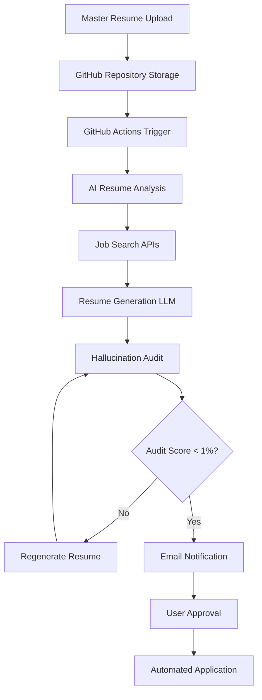

# 🤖 SkillSync Automator

> **AI-Powered Job Search Automation Platform**

Automate your entire job search with AI-powered resume optimization, intelligent job matching, and ATS compliance verification. Get hired 5x faster with SkillSync Automator.

## 🚀 Features

- **🧠 AI Resume Analysis**: Extract skills and match job opportunities using advanced LLMs
- **📄 ATS Optimization**: Generate tailored resumes optimized for Applicant Tracking Systems  
- **🔍 Automated Job Search**: Find relevant positions from multiple job boards automatically
- **🛡️ Hallucination Detection**: AI-powered accuracy verification prevents resume fabrication
- **📧 Smart Notifications**: Email alerts with approve/revise workflow
- **⚡ GitHub Actions**: Fully automated daily job search and application workflow
- **📊 Quality Metrics**: Detailed audit reports and match scoring

## 🏗️ Architecture



## 📦 Installation & Setup

### Prerequisites

- GitHub account with repository access
- Hugging Face account (free tier)
- Email service API key (SendGrid/Mailgun)

### 1. Repository Setup

1. **Fork or create a new repository** from this template
2. **Enable GitHub Actions** in repository settings
3. **Create the following repository secrets**:

```bash
# Required Secrets (Settings → Secrets and variables → Actions)
HUGGINGFACE_API_KEY=hf_xxxxxxxxxxxxxxxxxxxx
EMAIL_API_KEY=SG.xxxxxxxxxxxxxxxxxxxx  # SendGrid API key
USER_EMAIL=your-email@example.com
WEBHOOK_URL=https://your-webhook.com/endpoint  # Optional
```

### 2. Local Development Setup

```bash
# Clone the repository
git clone https://github.com/yourusername/skill-sync-automator.git
cd skill-sync-automator

# Install Python dependencies
pip install -r requirements.txt

# Install Node.js dependencies for frontend
npm install

# Start development server
npm run dev
```

### 3. API Keys Configuration

#### Hugging Face API Key
1. Go to [Hugging Face Settings](https://huggingface.co/settings/tokens)
2. Create a new token with **Read** permissions
3. Add as `HUGGINGFACE_API_KEY` repository secret

#### GitHub Personal Access Token
1. Go to [GitHub Settings → Developer settings → Personal access tokens](https://github.com/settings/tokens)
2. Generate new token with **repo** permissions
3. Use in the web interface when uploading resumes

#### Email Service (SendGrid)
1. Sign up at [SendGrid](https://sendgrid.com/)
2. Create API key with **Mail Send** permissions
3. Add as `EMAIL_API_KEY` repository secret

## 🖥️ Usage

### Web Interface

1. **Access the application**: Visit your GitHub Pages URL or run locally
2. **Upload master resume**: Use the upload interface to store your resume in GitHub
3. **Configure settings**: Set up API keys and automation preferences
4. **Monitor results**: Check the dashboard for generated resumes and audit reports

### Automated Workflow

The system runs automatically every day at 8:00 AM UTC via GitHub Actions:

1. **Resume Analysis**: AI extracts skills and determines suitable job titles
2. **Job Search**: Searches job boards for matching positions
3. **Resume Generation**: Creates ATS-optimized resumes for each job
4. **Quality Audit**: Verifies accuracy and detects hallucinations
5. **Email Notifications**: Sends results with approve/revise options

### Manual Triggers

```bash
# Trigger automation manually
gh workflow run automate.yml

# Or via GitHub web interface
# Actions → SkillSync Job Search Automation → Run workflow
```

## 📁 Repository Structure

```
skill-sync-automator/
├── .github/workflows/
│   └── automate.yml          # GitHub Actions automation workflow
├── src/
│   ├── components/           # React components
│   ├── pages/               # Application pages
│   └── lib/                 # Utility functions
├── resumes/                 # Master resume storage
├── jobs/                    # Job listings (JSON format)
├── generated_resumes/       # ATS-optimized resumes
├── reports/                 # Audit reports
├── main.py                  # Python automation script
├── requirements.txt         # Python dependencies
└── README.md               # This file
```

## 🔧 Configuration Options

### Automation Settings
```yaml
# .github/workflows/automate.yml
schedule:
  - cron: "0 8 * * *"  # Daily at 8 AM UTC

# Modify for different frequencies:
# "0 */12 * * *"     # Every 12 hours
# "0 8 * * 1-5"      # Weekdays only
```

### AI Models
```python
# main.py - Customize AI models
resume_analyzer_model = "microsoft/DialoGPT-medium"
resume_generator_model = "microsoft/DialoGPT-medium" 
audit_model = "sentence-transformers/all-MiniLM-L6-v2"
```

### Quality Thresholds
```python
# Hallucination detection threshold
HALLUCINATION_THRESHOLD = 1.0  # Percentage

# Match score requirements
MIN_MATCH_SCORE = 70  # Minimum job match percentage
```

## 📊 Monitoring & Analytics

### GitHub Actions Logs
- View automation results in **Actions** tab
- Check step-by-step execution logs
- Monitor success/failure rates

### Quality Metrics
- **Overall Score**: Resume quality and ATS optimization
- **Hallucination Score**: Accuracy verification (lower is better)
- **Match Score**: Job requirement alignment

### Email Reports
- Daily automation summaries
- Individual resume notifications
- Quality audit results

## 🛠️ Customization

### Adding New Job Boards

```python
# main.py - Add custom job search APIs
def search_custom_job_board(self, keywords):
    response = requests.get(
        "https://api.jobboard.com/search",
        params={"q": keywords, "api_key": self.job_api_key}
    )
    return response.json()
```

### Custom Resume Templates

```python
# Create custom resume templates
def create_custom_template(self, job_data, skills):
    template = f"""
    Professional Summary optimized for {job_data['title']}
    
    Core Competencies: {', '.join(skills)}
    
    [Your custom template structure]
    """
    return template
```

### Integration with Other Services

```python
# Add Slack notifications
def send_slack_notification(self, message):
    requests.post(self.slack_webhook, json={"text": message})

# Add Airtable logging
def log_to_airtable(self, job_data, results):
    # Custom integration code
```

## 🔒 Security & Privacy

- **Local Storage**: GitHub tokens stored locally, never transmitted
- **Encrypted Secrets**: Repository secrets encrypted by GitHub
- **No External Servers**: Runs entirely on GitHub infrastructure
- **Audit Trail**: Complete activity logging in GitHub Actions

## 🚨 Troubleshooting

### Common Issues

1. **No jobs found**
   - Check if master resume is uploaded
   - Verify API keys in repository secrets
   - Review GitHub Actions logs

2. **High hallucination scores**
   - Check master resume quality and completeness
   - Adjust hallucination threshold in settings
   - Review audit reports for specific issues

3. **Email notifications not working**
   - Verify EMAIL_API_KEY and USER_EMAIL secrets
   - Check SendGrid account status
   - Review email service logs

### Debug Mode

```bash
# Run with debug logging
python main.py --debug

# Or set environment variable
export DEBUG=true
python main.py
```

## 🤝 Contributing

1. Fork the repository
2. Create a feature branch (`git checkout -b feature/amazing-feature`)
3. Commit your changes (`git commit -m 'Add amazing feature'`)
4. Push to the branch (`git push origin feature/amazing-feature`)
5. Open a Pull Request

## 📄 License

This project is licensed under the MIT License - see the [LICENSE](LICENSE) file for details.

## ⚠️ Disclaimers

- **Job Applications**: Always review generated resumes before applying
- **API Limits**: Free tier APIs have usage limitations
- **Accuracy**: While AI-powered, always verify resume accuracy
- **Compliance**: Ensure compliance with job board terms of service

## 📞 Support

- **Issues**: [GitHub Issues](https://github.com/yourusername/skill-sync-automator/issues)
- **Discussions**: [GitHub Discussions](https://github.com/yourusername/skill-sync-automator/discussions)
- **Email**: support@skillsync.dev

---

**Made with ❤️ by the SkillSync Team**

*Automate your job search. Focus on what matters.*